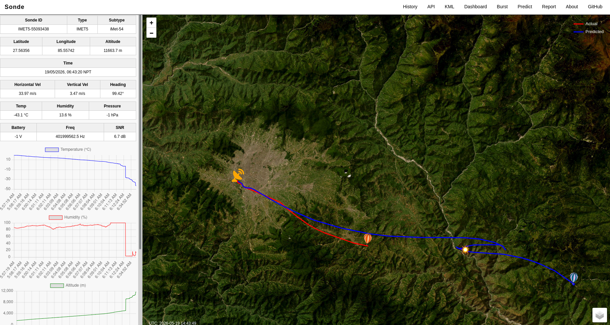

# Radiosonde Tracking 

A web-based radiosonde tracking platform.

**Live Site:** [sonde.kushal-kc.com.np](https://sonde.kushal-kc.com.np/)

[](https://sonde.kushal-kc.com.np/)

---

## About

This project provides real-time and historical tracking of **radiosondes** — battery-powered telemetry instruments carried into the atmosphere by weather balloons. Radiosondes measure and transmit key atmospheric parameters including:

- Temperature
- Relative Humidity
- Altitude & Pressure
- Wind Speed & Direction
- GPS Position (Latitude / Longitude)


Radiosonde detection and decoding is powered by [**radiosonde_auto_rx**](https://github.com/projecthorus/radiosonde_auto_rx) — an open-source decoder that automatically detects and decodes radiosonde signals using RTL-SDR or AirSpy receivers.

---

## Features

- **Live Map View** — Real-time radiosonde positions on an interactive map, with live telemetry, predicted flight path, KML download, hodograph, and more
- **Flight Prediction** — Adjust ascent rate, burst altitude, and other parameters to generate a predicted flight path; export as CSV or KML
- **Burst Calculator** — Estimate balloon burst altitude based on fill parameters
- **3D Visualization** — Upload a KML file to view the flight path in 3D using Cesium
- **Historical Data** — Browse past radiosonde flights by date or serial number
- **Sonde Recovery Reporting** — Submit a report if you find a landed radiosonde
- **API Access** — Programmatic access to sonde lists, telemetry, KML paths, Skew-T plots, and hodograph images

---

## Pages

| URL | Description |
|-----|-------------|
| `/` | Live tracker — latest sonde positions, predicted path, KML download, hodograph, live telemetry |
| `/predict/` | Flight path predictor — adjust parameters, export CSV/KML (uses [TAWHIRI](https://github.com/cuspaceflight/tawhiri) engine) |
| `/burst/` | Balloon burst altitude calculator |
| `/3d/` | 3D flight path viewer — upload a KML file, rendered with Cesium |
| `/history/` | Historical flight data browser |
| `/report/submit/` | Report a found/recovered radiosonde |
| `/accounts/dash/` | User dashboard — register or sign in with Google to get your API key |

---

## Data Forwarding

This platform accepts radiosonde telemetry forwarded from **radiosonde_auto_rx** stations. If you run a receiver, you can contribute data to this site.

### Requirements

```
pip install python-socketio requests
```

### Steps

1. Run `radiosonde_auto_rx` on your receiver station (default web interface at `http://0.0.0.0:5000`)
2. Register at [sonde.kushal-kc.com.np/accounts/dash/](https://sonde.kushal-kc.com.np/accounts/dash/) via Google or email to get your API key
3. Add your API key to `forwarder.py` and run it

### forwarder.py

```python
import socketio
import requests

SERVER = "https://sonde.kushal-kc.com.np/api/injest"
API_KEY = ""  # Your API key from the dashboard

sio = socketio.Client()

@sio.on('connect', namespace='/update_status')
def on_connect():
    print("Connected to Sonde source")

@sio.on('disconnect', namespace='/update_status')
def on_disconnect():
    print("Disconnected")

# Telemetry event — forwards sonde position data to the server
@sio.on('telemetry_event', namespace='/update_status')
def on_data(data):
    try:
        requests.post(
            SERVER,
            json=data,
            headers={"X-API-KEY": API_KEY},
            timeout=2
        )
        print("Forwarded:", data.get("id"), data.get("lat"), data.get("lon"))
    except Exception as e:
        print("Failed:", e)

# Debug events
@sio.on('scan_event', namespace='/update_status')
def on_scan(data):
    print("SCAN:", data)

@sio.on('log_event', namespace='/update_status')
def on_log(data):
    print("LOG:", data)

# Connect to local auto_rx instance
sio.connect(
    'http://0.0.0.0:5000',
    namespaces=['/update_status']
)
sio.wait()
```

> The forwarder connects to your local `radiosonde_auto_rx` web interface and streams telemetry events to the Sonde server in real time. Make sure `auto_rx` is running before starting the forwarder.

---

## API Documentation

**Base URL:** `https://sonde.kushal-kc.com.np`

### Authentication

Include your API key in the request headers:

```
X-API-KEY: YOUR_API_KEY
```

Get your API key from the [dashboard](https://sonde.kushal-kc.com.np/accounts/dash/) after registering.

> There is no rate limit on the API — please use it responsibly.

---

### 1. Get Sonde List by Date

```
GET /data/sondes_by_date/?date=YYYY-MM-DD
```

Returns a list of sonde IDs active on a given date. **Requires API key.**

**curl:**
```bash
curl "https://sonde.kushal-kc.com.np/data/sondes_by_date/?date=2026-05-04" \
  -H "X-API-KEY: YOUR_KEY"
```

**Python:**
```python
import requests

url = "https://sonde.kushal-kc.com.np/data/sondes_by_date/"
headers = {"X-API-KEY": "YOUR_KEY"}
params = {"date": "2026-05-04"}

r = requests.get(url, headers=headers, params=params)
print(r.json())
```

---

### 2. Get Sonde Telemetry

```
GET /data/sonde_data/?sonde_id=ID
```

Returns full telemetry data for a given sonde. **Requires API key.**

**curl:**
```bash
curl "https://sonde.kushal-kc.com.np/data/sonde_data/?sonde_id=IMET5-55095407" \
  -H "X-API-KEY: YOUR_KEY"
```

**Python:**
```python
import requests

url = "https://sonde.kushal-kc.com.np/data/sonde_data/"
headers = {"X-API-KEY": "YOUR_KEY"}
params = {"sonde_id": "IMET5-55095407"}

r = requests.get(url, headers=headers, params=params)
print(r.json())
```

---

### 3. Download KML Path

```
GET /data/sonde_KML/?sonde_id=ID
```

Downloads the flight path as a `.kml` file. **Requires API key.**

**curl:**
```bash
curl "https://sonde.kushal-kc.com.np/data/sonde_KML/?sonde_id=IMET5-55095407" \
  -H "X-API-KEY: YOUR_KEY" \
  -o sonde.kml
```

**Python:**
```python
import requests

url = "https://sonde.kushal-kc.com.np/data/sonde_KML/"
headers = {"X-API-KEY": "YOUR_KEY"}
params = {"sonde_id": "IMET5-55095407"}

r = requests.get(url, headers=headers, params=params)
with open("sonde.kml", "wb") as f:
    f.write(r.content)
```

---

### 4. Skew-T Plot

```
GET /data/skewt/?sonde_id=ID
```

Returns a Skew-T meteorological plot image. No API key required.

```
https://sonde.kushal-kc.com.np/data/skewt/?sonde_id=IMET5-55093438
```

---

### 5. Hodograph

```
GET /data/hodograph/?sonde_id=ID
```

Returns a hodograph (wind profile) image. No API key required.

```
https://sonde.kushal-kc.com.np/data/hodograph/?sonde_id=IMET5-55093438
```

---

### API Key Requirement Summary

| Endpoint | Auth Required |
|----------|:---:|
| `/data/sondes_by_date/` | Yes |
| `/data/sonde_data/` | Yes |
| `/data/sonde_KML/` | Yes |
| `/data/skewt/` | No |
| `/data/hodograph/` | No |

---

## Acknowledgements

- [projecthorus/radiosonde_auto_rx](https://github.com/projecthorus/radiosonde_auto_rx) — open-source radiosonde decoder and auto-tracking software
- [TAWHIRI](https://github.com/cuspaceflight/tawhiri) — flight prediction engine used for trajectory forecasting
- [CesiumJS](https://cesium.com/) — 3D globe rendering for flight path visualization

---

## Author

**Kushal KC**
- [kckushal.com.np](https://www.kushal-kc.com.np/)

---

## License

This project is open source under the [MIT License](LICENSE).
